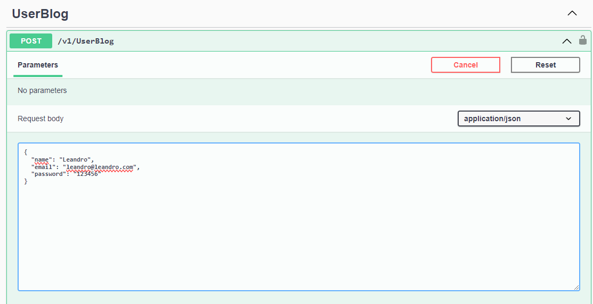
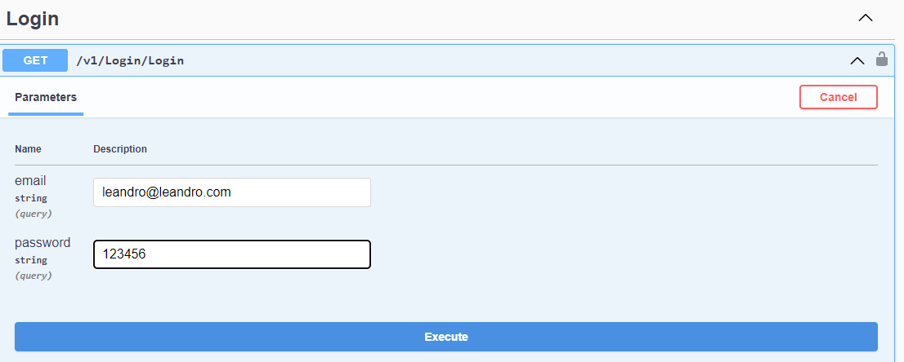
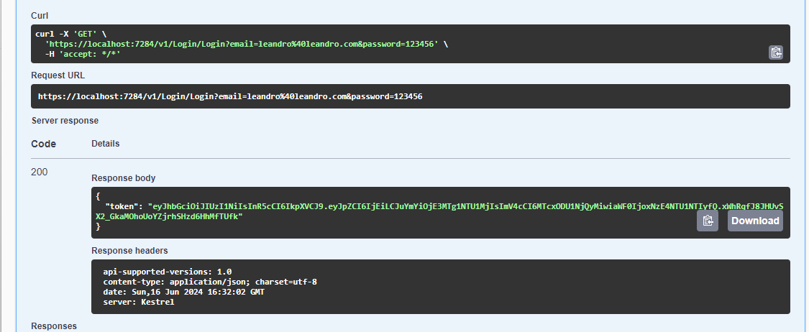
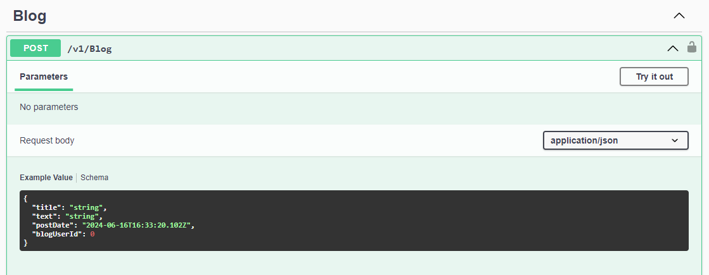
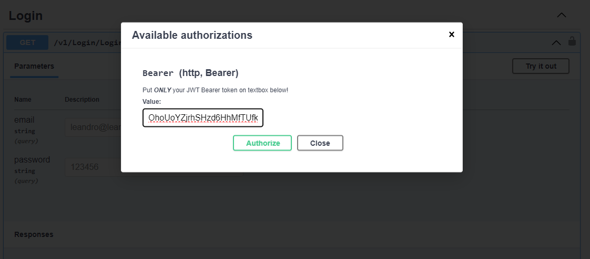
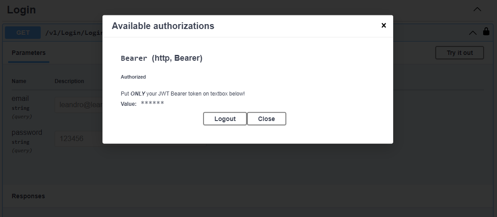
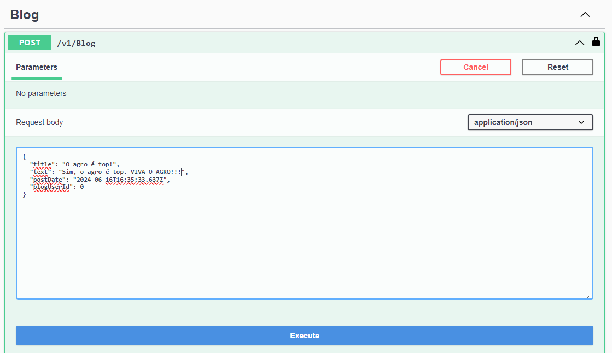
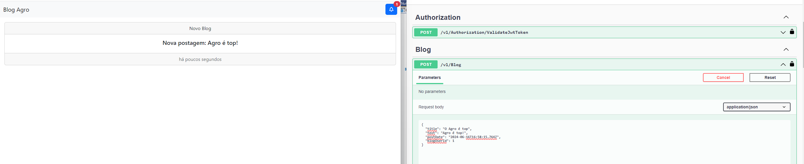
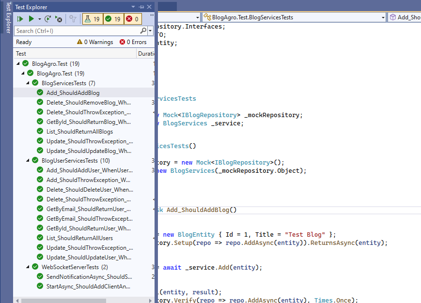

## Sistema de blog AGROBLOG;

## Requisitos Funcionais:

Autenticação: Usuários devem ser capazes de se registrar, fazer login.
Gerenciamento de Postagens: Os usuários autenticados podem criar postagens, editar suas
próprias postagens e excluir postagens existentes.
Visualização de Postagens: Qualquer visitante do site pode visualizar as postagens existentes.
Notificações em Tempo Real: Implemente um sistema de notificação em tempo real usando
WebSockets para informar os usuários sobre novas postagens assim que são publicadas.

## Requisitos Técnicos:

Utilize a arquitetura monolítica organizando as responsabilidades, como autenticação,
gerenciamento de postagens e notificações em tempo real.
Aplique os princípios SOLID, especialmente o princípio da Responsabilidade Única (SRP) e o
princípio da Inversão de Dependência (DIP).
Utilize o Entity Framework para interagir com o banco de dados para armazenar informações
sobre usuários e postagens.
Implemente WebSockets para notificações em tempo real. Pode ser uma notificação simples
para interface do usuário sempre que uma nova postagem é feita

## Teste do codigo;

Necessário utilização do SQL EXPRESS onde esteja com windows authentication ativado
-   A string de conexão se utiliza do mesmo para realizar o migration com entity framework

Ao utilizar os comandos abaixo, se certifique de utilizar o Package Manager Console e selecionar o projeto correto que é o BlogAgro.Data
Nesse projeto contempla os artefatos necessários para que o migration seja realizado.

add-migration InitialCreate -context ApplicationCommandContext
update-database -context ApplicationCommandContext

## Criando um usuário para teste.
Ao executar a aplicação e acessar via swagger, utiliza a chamada abaixo para criar um usuário

Apoós criar o usuário, precisamos realizar o login para pegar o token posteriormente e passar nas chamadas.

Para postar, utilizamos a chamada abaixo e passamos o token

## Testes unitários.
Foram criados alguns cenários de tstes unitários demostrando o uso do Moq no qual é feita
uma cobertura significativa para fins de demostração

A aplicação tem swagger para teste da API 
E uma pagina index.html para teste a comunicação do websocket 
ao enviar pela api  endpoint /notification/ 

Com a pagina index aberta ao adicionar um blog na api controller /blog/ {post}
tambem aparecera uma noticação na pagina;
